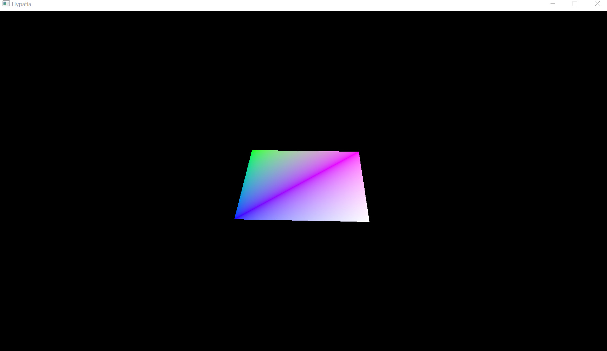

# Vulkan Renderer


**Vulkan-based render engine prototype. This is a toy project created to test some basic principles and paradigms of vulkan.**

## Why Vulkan

The 3d graphics libraries that help us communicate with the graphics card have suffered many breakdowns over time. With the advent of graphics cards and shaders, graphics programming has reached new horizons. These changes caused radical mind shifts in the architecture of these libraries. Previously, they abstracted many responsibilities from the user. Now, this approach has evolved over time to give all responsibility to the user. The next-generation graphics libraries Vulkan, Metal, and DirectX12 work with this principle. This improved performance along with the reduction of driver overheads. This repo includes some experiments with Vulkan core concepts and is not a complete renderer.


## How to Use

Firstly create renderer object. 
```cpp
hypatia::Hypatia* hypatiaRenderer = new hypatia::Hypatia();
```
To initialize the renderer, we need to introduce window related information. You can use the RENDER_DECS object for this.
```cpp
hypatia::RENDERER_DESC rendererDesc = {};
rendererDesc.hwnd = glfwGetWin32Window(window);
rendererDesc.hInstance = GetModuleHandle(nullptr);
rendererDesc.extensions = getRequiredExtensions();
glfwGetFramebufferSize(window, &rendererDesc.frameBufferWidth, &rendererDesc.frameBufferHeight);

hypatiaRenderer->InitializeRenderer(&rendererDesc);
```
Add new entity to SceneGraph
```cpp
hypatia::Entity* entity = new hypatia::Entity();
entity->m_Material = hypatiaRenderer->GetResourceLibrary().m_Materials.at(0);
entity->m_Model = hypatiaRenderer->GetResourceLibrary().m_Models.at(0);
hypatiaRenderer->GetSceneGraph().addNewEntity(entity);
```
Add camera
```cpp
hypatia::Camera* camera = new hypatia::Camera();
hypatiaRenderer->GetSceneGraph().m_Camera = camera;
```

Call UpdateSceneGraph and Render methods to update scenegraph and render scene
```cpp
hypatiaRenderer->GetSceneGraph().UpdateSceneGraph();
hypatiaRenderer->Render();
```
